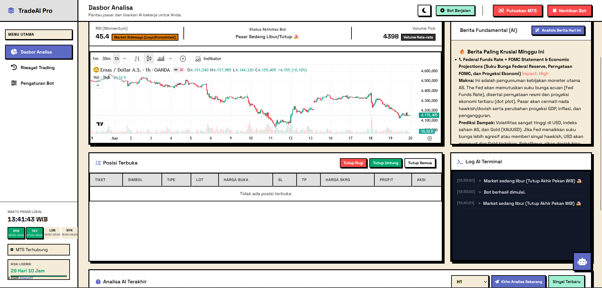

<p align="center">
  
  
  
</p>

<br>

<div align="center">
  
</div>

<br>

<div align="center">
  
</div>

<br>

<p align="center">
  <b>Analisis pasar real-time, eksekusi otomatis, dan manajemen risiko cerdas</b><br>
  <i>— dalam satu dashboard —</i>
</p>

<br>

<p align="center">
  Didukung oleh <b>6 engine AI</b> dengan failover otomatis:<br>
  <code>Gemini</code> • <code>OpenAI</code> • <code>Claude</code> • <code>DeepSeek</code> • <code>Ollama</code> • <code>Universal API</code>
</p>

<br>
<br>

<p align="center">
  <a href="https://github.com/ilmanalif/BOT-Trading-AI-Metatrader5/releases/download/Bot/AutoTradeAI.zip">
    
  </a>
</p>

<p align="center">
  <i>Free download • Siap pakai • No installasi rumit</i>
</p>

<br>

---

## 🚀 Fitur Unggulan

<table>
  <tr>
    <td width="50%" valign="top">
      <h3>🧠 Multi-Engine AI</h3>
      <p>6 provider AI dengan <b>failover otomatis</b>. Jika satu terkena rate-limit, bot pindah ke yang lain tanpa interupsi. Kamu bisa pakai banyak API key sekaligus.</p>
    </td>
    <td width="50%" valign="top">
      <h3>📊 Analisis Multi-Timeframe</h3>
      <p>Bot membaca <b>M15, H1, H4, dan D1</b> bersamaan. Chart candlestick dengan Fibonacci, support/resistance, dan swing points dikirim ke AI untuk analisis visual.</p>
    </td>
  </tr>
  <tr>
    <td width="50%" valign="top">
      <h3>🛡️ Risk Management Bawaan</h3>
      <p><b>Daily target 3%</b>, <b>max loss 5%</b>, auto lot sizing, proteksi over-trading. Kamu bisa tidur nyenyak tanpa khawatir.</p>
    </td>
    <td width="50%" valign="top">
      <h3>💬 Chat dengan AI</h3>
      <p>Mau tanya analisis, ubah parameter, tutup posisi, atau gambar support/resistance di chart? <b>Cukup ketik di chat.</b></p>
    </td>
  </tr>
  <tr>
    <td width="50%" valign="top">
      <h3>⚡ Auto & Manual Mode</h3>
      <p>AI bisa <b>eksekusi otomatis</b> 24/7, atau kamu review dulu setiap sinyal. Kendali penuh tetap di tanganmu.</p>
    </td>
    <td width="50%" valign="top">
      <h3>📱 Dashboard Web</h3>
      <p>Tampilan modern dengan TradingView chart, dark/light mode, dan <b>bisa diakses dari HP</b> dalam jaringan yang sama.</p>
    </td>
  </tr>
</table>

<br>

---

## ⚙️ Cara Kerja

<div align="center">

```
┌─────────────┐     ┌─────────────┐     ┌──────────────┐
│  MetaTrader │◄───►│  Auto Trade │◄───►│   AI Engine  │
│      5      │     │  AI Server  │     │  (6 Provider)│
│             │     │ :8000       │     │              │
└─────────────┘     └──────┬──────┘     └──────────────┘
                           │
                    ┌──────▼──────┐
                    │  Dashboard  │
                    │  (Browser)  │
                    └─────────────┘

```

</div>

<p align="center">
  <b>1.</b> Bot baca data pasar (candle, RSI, volume, posisi terbuka) ✦
  <b>2.</b> Bot generate chart multi-timeframe ✦
  <b>3.</b> Data dikirim ke AI ✦
  <b>4.</b> AI return keputusan: <code>BUY</code> / <code>SELL</code> / <code>HOLD</code> ✦
  <b>5.</b> Eksekusi otomatis atau menunggu persetujuanmu
</p>

<br>

---

## 🧠 Engine AI yang Didukung

| Provider | Model | Tipe Akses |
|----------|-------|------------|
|  | `gemini-2.5-pro` → `gemini-2.0-flash` | API Key |
|  | `gpt-4o-mini` | API Key |
|  | `deepseek-chat` | API Key |
|  | `claude-3-haiku` | API Key |
|  | Bebas (`llama3`, `mistral`, dll) | Server Lokal |
|  | Bebas | OpenAI-compatible |

<br>

---

## 🔒 Risk Management — Sepenuhnya Bisa Kamu Atur

```
 ╔══════════════════════════════════════════╗
 ║  Daily Target    ████████░░  3%          ║
 ║  Max Daily Loss  ██████████████░░░  5%   ║
 ║  Lot Size        ██░░░░░░░░░░░  Fixed    ║
 ║  TP/SL Mode      ████████░░░░  Auto AI   ║
 ║  Auto Trade      ⚡ Optional              ║
 ╚══════════════════════════════════════════╝
```

Tentukan sendiri target harian, batas loss, ukuran lot, jarak TP/SL, dan interval analisis. Bot akan berhenti otomatis saat target tercapai atau loss mencapai batas — kamu tinggal duduk santai.

<br>

---

## 🚀 Mulai dalam 5 Menit

<table>
  <tr>
    <td align="center" width="20%"><b>1</b></td>
    <td width="80%">Install <b>MetaTrader 5</b> dan login ke akun trading kamu</td>
  </tr>
  <tr>
    <td align="center" width="20%"><b>2</b></td>
    <td width="80%">Dapatkan <b>API key</b> dari provider AI (minimal satu, gratis pun bisa)</td>
  </tr>
  <tr>
    <td align="center" width="20%"><b>3</b></td>
    <td width="80%">Jalankan <code>AutoTradeAI.exe</code></td>
  </tr>
  <tr>
    <td align="center" width="20%"><b>4</b></td>
    <td width="80%">Buka <b>http://localhost:8000</b> di browser kamu</td>
  </tr>
  <tr>
    <td align="center" width="20%"><b>5</b></td>
    <td width="80%">Masukkan API key, koneksikan MT5, atur strategi, klik <b>Start Bot</b></td>
  </tr>
</table>

<br>

<p align="center">
  <b>Selesai.</b> AI mulai menganalisis pasar untukmu.
</p>

<br>

---

<p align="center">
  <i>Dibangun untuk trader Indonesia.</i><br>
  <b>Tidak perlu coding. Tidak perlu pengalaman AI.</b><br>
  Cukup jalankan dan biarkan AI bekerja.
</p>

<br>

<div align="center">
  
</div>
